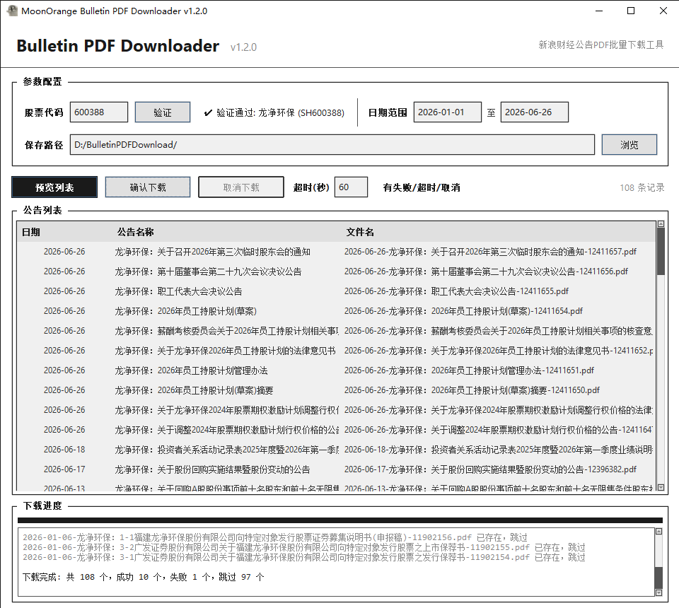

# MoonOrange Bulletin PDF Downloader

A GUI tool for batch downloading stock bulletin PDFs from Sina Finance, with stock code validation, date range filtering and progress tracking.

## Features

- **Stock Code Input** - Enter any A-share stock code (SH/SZ), with real-time validation via Sina Finance API
- **Date Range Filtering** - Set start and end dates to download only the bulletins you need
- **File Preview** - Preview the file list before downloading, showing date, bulletin name and filename
- **Batch Download** - Download all filtered PDFs with a single click, skip existing files automatically
- **Progress Tracking** - Real-time progress bar, download log with color-coded status (success/fail/skip)
- **Market Auto-Detection** - Automatically detects Shanghai (6xxxxx) or Shenzhen (0xxxxx/3xxxxx) market

## Screenshots



## Quick Start

### Run from source

```bash
pip install requests
python MoonOrangeBulletinPDFDownloader.py
```

### Build EXE

Double-click `build.bat` or run manually:

```bash
pip install pyinstaller
pyinstaller MoonOrangeBulletinPDFDownloader.spec --clean
```

The output EXE will be at `dist/MoonOrangeBulletinPDFDownloader.exe`.

## Usage

1. Enter a 6-digit stock code (e.g. `600388` for 龙净环保, `000001` for 平安银行)
2. Click **Validate** to verify the stock code
3. Set the date range and save path
4. Click **Preview** to see the list of bulletins
5. Click **Download** to start batch download

## Project Structure

```
MoonOrangeBulletinPDFDownloader.py   # Main application (GUI + core logic)
MoonOrangeBulletinPDFDownloader.spec # PyInstaller build config
build.bat                            # One-click build script
user_penguin.png                     # Application icon
```

## Dependencies

- Python 3.8+
- requests
- tkinter (built-in)

## License

MIT License - Free & Open Source

## Thanks

